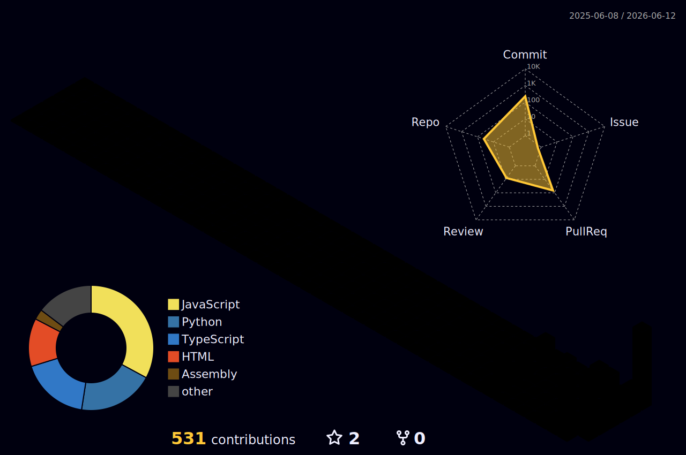

<div align="center">

<a href="https://github.com/Ap-0007">
  
</a>

<a href="https://github.com/Ap-0007">
  
</a>

<br/>

[](https://www.linkedin.com/in/anutsek-pathak-42a617371/)
[](https://github.com/Ap-0007)
[](https://blackbox-sos.vercel.app)


</div>

---

## `⚡ whoami`

```python
class VantaNox:
    def __init__(self):
        self.alias       = "vanta.nox"
        self.real        = "Anutsek Pathak"
        self.role        = "indie builder & systems architect"
        self.focus       = ["AI agents", "developer tools", "systems programming"]
        self.philosophy  = "most software is too polite — mine fights back"
        self.currently   = "building tools that think before you do"
        self.linkedin    = "linkedin.com/in/anutsek-pathak-42a617371"

    def stack(self):
        return {
            "languages":  ["Python", "TypeScript", "JavaScript", "Assembly"],
            "frontend":   ["React", "Next.js", "Vite", "Tailwind CSS"],
            "backend":    ["Node.js", "Express", "BullMQ", "Docker"],
            "ai":         ["Ollama", "LLMs", "pgvector", "Embeddings"],
            "infra":      ["Supabase", "PostgreSQL", "Redis", "Vercel"],
            "other":      ["React Native", "Expo", "Chrome Extensions"],
        }

    def motto(self):
        return "ship fast. break nothing. scare everyone."
```

---

## `🛠️ tech_stack`

<div align="center">

<p>
  
  
  
  
  
  
</p>


</div>

---

## `🚀 featured_projects`

<div align="center">

| | |
|---|---|
| **🚨 [blackbox-sos](https://github.com/Ap-0007/blackbox-sos)**<br>Passive crash detection — **React Native + Expo**. Sensor fusion auto-detects accidents, sends location + AI injury report to emergency services *before anyone makes a call.*<br>`react-native` `expo` `typescript` `sensor-fusion` `ai`<br>[](https://blackbox-sos.vercel.app) | **🧠 [forgetting-machine](https://github.com/Ap-0007/forgetting-machine)**<br>AI note system that **hides information until your brain is ready**. Spaced resurfacing via pgvector + BullMQ scheduler. Fully Dockerized.<br>`typescript` `react` `pgvector` `bullmq` `docker` |
| **🔮 [regret-simulator](https://github.com/Ap-0007/regret-simulator)**<br>Simulate **3 diverging 5-year life trajectories** for any major decision. Optimistic · Realistic · Pessimistic. Powered by Ollama + Next.js 14.<br>`nextjs` `ollama` `supabase` `tailwindcss` `llm` | **🪞 [parallel-you-engine](https://github.com/Ap-0007/parallel-you-engine)**<br>Two-phase **psychological profiling + scenario sim**. Interview builds your decision DNA → simulate what *you specifically* would do in any situation.<br>`react` `vite` `ollama` `psychology` |
| **⏰ [api-time-machine](https://github.com/Ap-0007/api-time-machine)**<br>Chrome extension + local server that **records XHR/fetch traffic** and replays any past app state. Debug by time-traveling to the exact moment of a bug.<br>`typescript` `chrome-extension` `pnpm-monorepo` | **💻 [myos](https://github.com/Ap-0007/myos)**<br>A custom **OS from scratch** in Assembly. No C runtime. No GRUB. No shortcuts. Bootloader → kernel → bare-metal.<br>`assembly` `osdev` `bare-metal` `kernel` `nasm` |

</div>

---

## `🔨 wip`

> ⚠️ actively in progress — unstable, undocumented, possibly dangerous

- `[ ]` something that watches your code and tells you when you're about to make a mistake
- `[ ]` a tool that makes distributed systems feel like they're running on your laptop

---

## `📊 github_analytics`

<div align="center">


<br/>


</div>

---

## `🌐 3d_contribution_skyline`

<div align="center">

> *every commit, stacked into a city — auto-generated daily*



</div>

---

## `📬 reach_me`

> I build fast, ship often, and occasionally write code that works on the first try.  
> Open to collabs, contracts, or just arguing about systems design.

<div align="center">

[](https://www.linkedin.com/in/anutsek-pathak-42a617371/)
[](https://github.com/Ap-0007)
[](https://blackbox-sos.vercel.app)

</div>

---

<div align="center">


</div>
